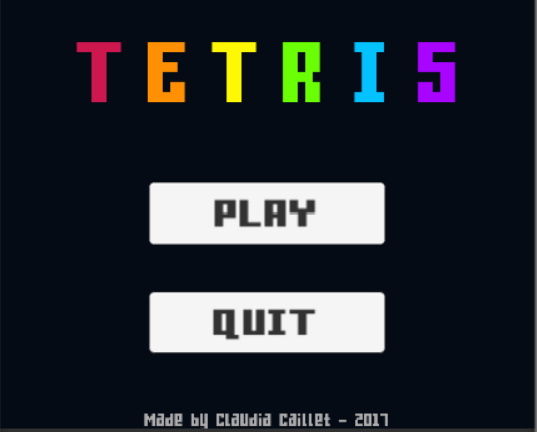
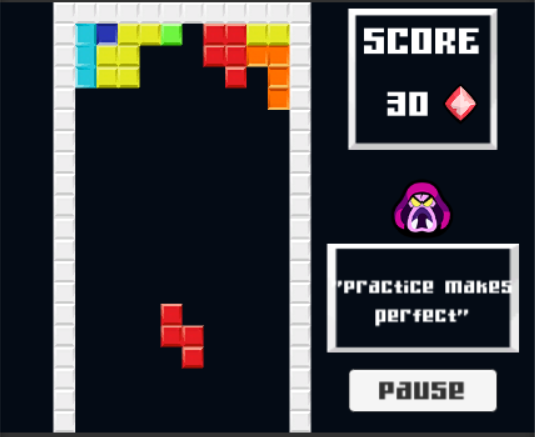
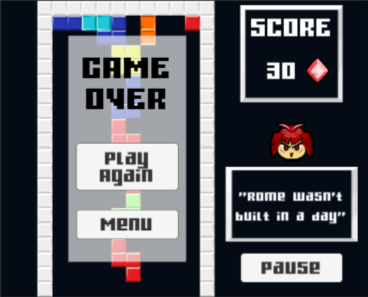

# TetrisLike

## Presentation

This is a **personal project** made on my spare time in approximately 15 hours. It was a technical test for an internship (which I obtained :)).

The goal was to code a **Tetris** game with **Unity** in which the pieces (called tetrominos) would go up instead of falling down.
Here are the various features:
  - Random pick of the next tetromino
  - Handling of **score** and **game over**
  - Start and pause **menus**
  - Increase of the pieces' speed each 5 rows completed
  - Images and random proverbs

## Screenshots

